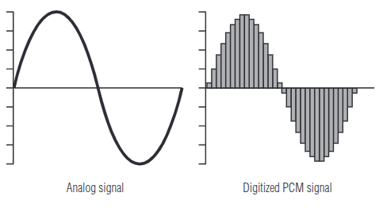

#### Introduction
One of the most important considerations in the design of digital musical devices is *latency*. Latency is the delay from a physical input (plucking a string, striking a key, etc.) to the production of an audible reponse. A digital music device with high latency can be perceived as low quality, and after a certain point, unusable.

For most traditional instruments, the physical interface of the instrument directly generates sound. The vibration of a string, or drum head, etc. creates sound pressure waves directly, with no other mechanical linkage. Then, there is virtually no delay or latency for the instrument.

For amplified instruments, sound is not generated directly from its physical interface. Instead, the input signal is collected by a sensor, routed into an amplification circuit, and outputted by a speaker. In the context of musical instrument amplification / effects processing, the propagation time through analog effects circuits and amplification circuits adds an imperceptible amount of latency.

For digital effects processing, there is far more indirection between the physical touch input and audible response. A short description of this process:
1. A sensor (magnetic pickup, microphone, etc.) converts vibrations of a string or sound pressure waves into small electric currents.
2. An ADC (analog-to-digital converter) samples the signal to create an audio bitstream, and communicates it to a computer processor. The ADC is a peripheral of an embedded system.
3. A computer/embedded processor performs digital signal processing algorithms on small chunks of the audio bitstream.
4. The processor sends chunks of the processed audio bitstream to a DAC (digital-to-analog converter), which converts the processed bitstream back into an analog signal.



(Image from Katz, Gentile. *Embedded media processing*. 1st ed. 2005)

A lot of care is required to fulfill this process without introducing unacceptably high latency.
#### Buffer size
To minimize the overhead of requesting/trasmitting audio data, loading it into functions, etc., most audio applications process audio in blocks of samples, instead of sample-by-sample. The selection of block size (buffer size) in realtime digital signal processing dictates how many audio samples are processed in a batch. The latency in digital audio processing is proportional to the block/buffer size used.

A 44.1kHz sampling rate is standard for digital music files. For this sampling rate, one sample of the input signal is taken every $T_s$ seconds.
$T_s = 1/44100 = 22.6\mu s$

Then, a buffer size of 128 samples holds $128\ T_s = 2.9ms$ of audio data.

A double-buffering scheme is used, so that at once, one block is used to collect audio data, and the other block is used for processing and output. By the time the 'collection' buffer is full, the 'processing' buffer must be fully processed and ready for output. Therefore, a time constraint is imposed on the signal processing functions, because the 'processing' buffer must be fully processed before the next block is loaded.

The latency introduced is then *at least* twice the amount of time held in one block. For a block size of 128 samples at a sampling rate of 44.1kHz, the buffer first takes 2.9ms to be fully loaded, and then must be processed and ready to be output after another 2.9ms.

To minimize latency, the *smallest possible* buffer size is used. A smaller buffer size increases the processing and I/O overhead, and tightens the time constraint on the signal processing functions. If the processing buffer is not fully processed before its 'deadline', then the audio will have audible glitches or completely drop out. 

Then, the choice of buffer size is a compromise between stability, performance, and complexity.

```
block/buffer size:

    low <----------------------------------> high
 (low latency)                          (high latency)
  (less stable)                           (stable)
(simple DSP functions)          (allows more complex DSP functions)
```

We then want to choose a buffer size that is completely stable, while remaining acceptably performant.

The minimum *stable* buffer size depends on several factors, including:
- Transmission overhead from audio codec (ADC & DAC)
- Complexity of signal processing algorithms
- Processor speed, concurrent processes
#### Determining range of acceptable latency
<12ms latency, <=1ms jitter, less is better
\[will be updated soon]
#### Measuring latency
\[will be updated soon]
#### References
\[1] “Audio I/O: Buffering, Latency, and Throughput - MATLAB & Simulink.” Accessed: Feb. 16, 2026. \[Online]. Available: [https://www.mathworks.com/help/audio/gs/audio-io-buffering-latency-and-throughput.html](https://www.mathworks.com/help/audio/gs/audio-io-buffering-latency-and-throughput.html)

\[2] D. J. Katz and R. Gentile, _Embedded media processing_, 1st ed. Boston: Elsevier/Newnes, 2005.

\[3] robert bristow-johnson, “Answer to ‘Trying to understand the general scheme of how real-time audio signal processing works on embedded system,’” Signal Processing Stack Exchange. Accessed: Feb. 16, 2026. \[Online]. Available: [https://dsp.stackexchange.com/a/91564](https://dsp.stackexchange.com/a/91564)

\[4] R. H. Jack, A. Mehrabi, T. Stockman, and A. McPherson, “Action-sound Latency and the Perceived Quality of Digital Musical Instruments,” _Music Perception_, vol. 36, no. 1, pp. 109–128, Sep. 2018, doi: [10.1525/mp.2018.36.1.109](https://doi.org/10.1525/mp.2018.36.1.109).

\[5] A. Schmid, M. Ambros, J. Bogon, and R. Wimmer, “Measuring the Just Noticeable Difference for Audio Latency,” in _Audio Mostly 2024 - Explorations in Sonic Cultures_, Milan Italy: ACM, Sep. 2024, pp. 325–331. doi: [10.1145/3678299.3678331](https://doi.org/10.1145/3678299.3678331).

