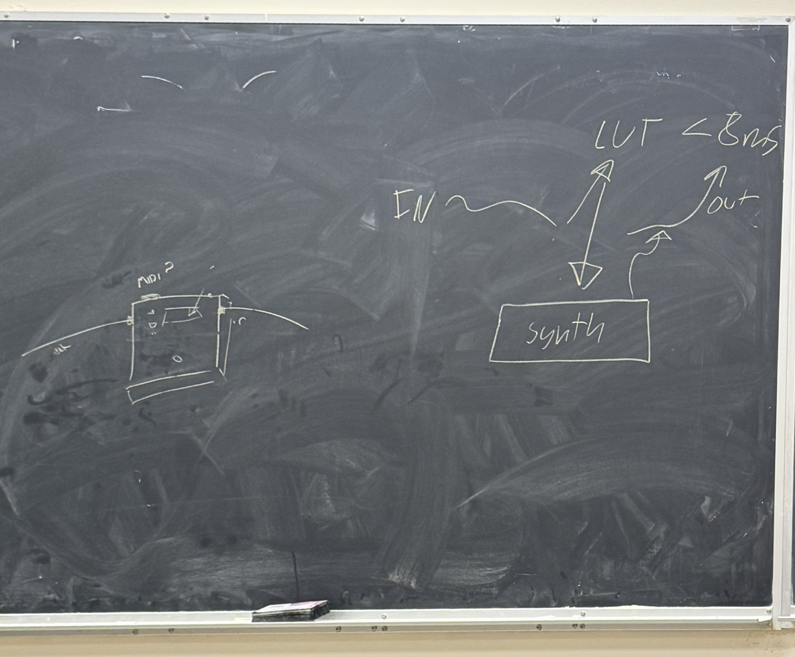

Status Report 3
Group 2 CSE 123

#### Checklist 
(-) Not Done (+) Done (~) In Progress
~ Personas
+ Need Statement
+ Goal Statement
- Design Objective
- Conceptualisations
~ Decision Table
~ Basic Plan 
- Gantt Chart
- Aesthetic & Functional Prototypes
- Design for Manufacture & Assembly
- Test Plan
- Test Report
- Life Cycle Assessment
- Ethics Statement
- 3D CAD of final deliverable for prototype showcasing

#### Timeline
As for the prototype demo for finals, we’ve decided to implement a breadboard version with the daisy seed to cause a simple effect (distortion or fuzz) live with an input from a guitar and output through a guitar amp. We will be using a single note to demonstrate the logic of the system and the daisy seed should be able to act as a music pedal, implementing that unique sound effect with hopefully >8ms latency. 

Therefore, to reach this timeline, we want to finish most of the software development by at least week 9, create a hardware and analog interface within the next couple of weeks, and look into artistic developments that could be made along the way. We want to create a functional prototype that both looks nice and works. We’ve divided ourselves into different teams and have updated the github with a Kanban style system.

#### Script
We want to first present our need and goal statements, then show a live demo of our design, with a breadboard and wires to show that rough logic processing as well as supportive CAD and schematic designs to convey what our pedal is capable of doing and implementing a simple workflow to ensure that what we can do is achievable within the given time frame. 

#### Collaboration System Links
Github: [https://github.com/sbarry753/cse123](https://github.com/sbarry753/cse123 )

#### Weekly Progress Summary
This week we….

Meeting 1 (2/9/26)
The embedded systems group met with Zion and talked about benchmarking on teensy and daisy seed. 
Went through details like block size, complexities of audio samples, and processing power.
Created a timeline for gathering metrics and testing latency
As both boards are sufficiently powerful and have small block sizes, latency may not be as big of an issue as previously thought
Still going to benchmark audio latency, but also note ease of development as another metric to choose which microcontroller platform

Meeting 2 (2/10/26)
Discussed with TA our long term plans and utilization of collaborative tools
Took time to understand the holistic picture and what each role needs to accomplish.
Learned about the different effects and pedals capabilities with Nick’s software and equipment.

Meeting 3 (2/12/26)
Went over technical design and overview of the project with Professor Harrison.
Drew how our project final deliverable would look like and also the rough overview of the “smarts” internally. 
Learned some client-sided questioned questions from Professor Harrison such as user accessibility. Since we are most likely to be focussed on musicians who may have no technical experience or people who are buying a pedal for the first time, we have to make it easy to use and may even implement updating capabilities.
Focussed on the final deliverable requirements rather than just focussing on the prototype requirements due at the end of this quarter.

#### Current Personas + Clientele
People who play guitar but want common synth effects like wave folding specifically made for guitars in a guitar pedal form factor

#### Current Need Statement
“Articulate the need as an expression of dissatisfaction with the current situation”

There exists no guitar pedal or it is uncommon that guitar pedals exist that either replicates a specific cool vintage pedal/amp/speaker or does this certain effect using digital and analog components. 

Sometimes, musicians want to create a unique sound that might not be feasible to attain without dedicating lots of time and money to do. Our pedal aims to allow musicians to attain these sounds without having to spend their time and money on a new instrument.

#### Current Goal Statement
“A brief, general, and ideal response to the need statement”

Design an enviable guitar pedal that digitally (or analog + digital) recreates a vintage effect or rare/new/uncommon effect with low enough latency that the effect can be used for live performance and fits within a standard guitar pedal enclosure. We aim to have a >8ms latency to emphasis ease of use.

#### Nick’s Breakthrough with Polyphonic Algorithms

Nick was able to implement a “polyphonic algorithm” using a table of similar frequencies that can take an input and resemble that frequency to a table with a pitch shifter, that can then output that pitched note for it to be used with the unique effects portion as seen with the schema drawing from before. Right now, it works with a single guitar note, however we hope to extend this to a wider range of guitar pitches and even have it work for different instruments to increase its accessibility. 
Read more about it here:
[https://github.com/sbarry753/cse123/tree/GuitarEffectTrials/LUT%20Development](https://github.com/sbarry753/cse123/tree/GuitarEffectTrials/LUT%20Development)

#### Benchmarking Ideas
Benchmarking Harness
Need a common interface for benchmarking latency across MCUs
This harness should support both MCUs with compiler flags/config changes
Both MCUs would run the same effects
Only difference is board-specific audio I/O
Test different block sizes, sample rates, and effects
The responsibility of the harness is to create MCU-agnostic DSP effects in raw C++
The Daisy/Teensy would call this harness in their audio callback functions
Harness Overview
Contains the effects
Simple, medium, complex effect 
Effects with different block sizes
Entry point function to process audio from callback
In audio callback: store CPU load metrics in buffer (processed outside of interrupt loop)
Number of cycles/time spent in block
CPU utilization
CPU Load Measurement
Daisy
CpuLoadMeter Source
Use CpuLoadMeter class, call OnBlockStart() at beginning of audio callback function and OnBlockEnd() at the end of the function
Can measure CPU load with this class
As the audio effect isn't the only thing the MCU would do (ex. note classification via LUT), would need to make sure there's enough CPU power for audio effect + other MCU responsibilities

#### Current Research Explored
This week we looked at…..

Special effects implementations

Distortion effect takes in a waveform and “clips” it so that the natural frequencies produce a more square wavelength that sounds a fuzzy sound.

The overdrive effect is very similar to the distortion effect, in that instead of clipping it from the top, it “squeezes” the waveform from its sides to create a sharper tone. This creates a smoother, creamier tone.

The fuzz effect is an aggressive transformation that changes the signal into a square signal. It creates a sharp, gritty, and aggressive tone.

Wavefolding is when the frequency folds into itself after a peak, creating a synthetic sound. This effect is quite difficult and mathematicaly intense, however, it is definetley an achievable effect and a goal for Spring quarter. 

Figure of chalkboard drawing during professor meeting. On the left is and example mock-up for the physical design of the pedal. On the right is a schematic of the device’s effects process. 

#### Sources
[1] “Beginner guide: Overdrive & distortion pedals,” Andertons Blog, https://blog.andertons.co.uk/learn/distortion-pedal-beginners-guide (accessed Feb. 13, 2026).
[2] J. Chowdhury, “Wavefolding¶,” Wavefolder, https://ccrma.stanford.edu/~jatin/ComplexNonlinearities/Wavefolder.html (accessed Feb. 13, 2026).
[3] “Distortion Explanation,” Distortion Effect Page, https://www.donreiman.com/Distortion/Distortion.htm (accessed Feb. 13, 2026).
