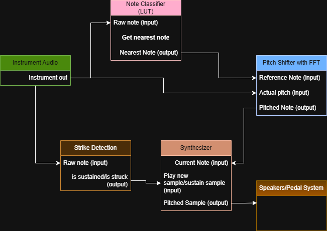

# Guitar → Harmonic Fingerprint LUT → Note Detection → Synth (JUCE VST)

A research-stage pipeline for converting recorded guitar notes into **normalized harmonic fingerprints**, stored in a lookup table (LUT), for real-time note detection inside a future JUCE VST.

---

## Project Goal

The long-term goal is to build a guitar-to-synth VST that:

1. Takes live instrument input
2. Identifies which note is being played
3. Uses that detected note to trigger a separate synthesized or sampled sound

This repository contains the **Python modeling + detection stage**, which:

- Extracts harmonic fingerprints from recorded guitar notes
- Stores them in a lookup table (LUT)
- Matches unknown input audio against the LUT
- Selects the most similar note using cosine similarity

This system does **not** recreate the waveform directly.  
Instead, it performs **template matching in harmonic space**.

---

## Core Idea

Instead of fitting sine waves to reconstruct the signal, we:

1. Assume a candidate note with known fundamental frequency: f0
2. Measure harmonic energy at integer multiples:

   fk = k * f0

3. Normalize those harmonic amplitudes
4. Store that normalized vector as the note’s fingerprint

Later, live input is classified by comparing its harmonic fingerprint to the LUT.

---

## Harmonic Fingerprint Model

For a note with fundamental f0, we compute:

Hk = energy near (k * f0)

for k = 1, 2, ..., K

We then normalize:

Hk_norm = Hk / (sum_{i=1..K} Hi)

The resulting vector:

h = [H1_norm, H2_norm, ..., HK_norm]

is the **harmonic fingerprint** of that note.

This removes loudness dependency and focuses only on harmonic structure.

---

## Why This Works

A guitar tone consists of:

- A fundamental frequency
- Harmonic overtones
- A transient attack

The harmonic amplitude ratios are relatively stable for:

- A given string
- A given fret
- A given pickup configuration

Even if:

- Volume changes
- Pick strength changes
- Slight EQ shifts occur

…the **relative harmonic structure** remains similar.

This makes harmonic fingerprints effective for classification.

---

## FFT Analysis

We compute the short-time FFT of a Hann-windowed segment:

X[k] = Σ_{n=0..N-1} x[n] * w[n] * exp(-j * 2π * k * n / N)

We then measure harmonic energy as:

Hk = max(|X(f)|) near (k * f0)

within a small tolerance window (e.g., ±15 Hz).

This is repeated for each harmonic.

---

## Live Note Detection (Template Matching)

For an unknown input signal:

1. For each candidate note in the LUT:
   - Assume its known f0
   - Extract harmonic fingerprint from live audio
2. Compare the live fingerprint h_live with stored template h_lut

We use cosine similarity:

similarity = (h_live · h_lut) / (||h_live|| * ||h_lut||)

The note with the highest similarity is selected.

This avoids explicit fundamental detection and reduces octave errors.

---

## LUT Format

Example entry:

```json
{
  "note": "E6",
  "midi": 88,
  "f0_hz": 1318.51,
  "k": 60,
  "fingerprint": [0.28, 0.21, 0.16, 0.09]
}
```
---

## System Architecture

Below is the high-level signal flow of the system:



### Flow Overview

1. **Instrument Audio**
   - Raw guitar signal enters the system.

2. **Note Classifier (LUT)**
   - Extracts harmonic fingerprint
   - Compares against stored LUT entries
   - Outputs nearest note identity

3. **Pitch Tracking (FFT-based)**
   - Tracks actual continuous pitch (for bends/vibrato)
   - Uses reference note from classifier
   - Outputs real-time pitch ratio

4. **Strike Detection**
   - Detects whether note is newly struck or sustained
   - Controls envelope triggering

5. **Synthesizer**
   - Receives:
     - Detected note identity
     - Continuous pitch data
     - Strike state
   - Plays or sustains sample
   - Applies pitch shifting if needed

6. **Output**
   - Final synthesized audio sent to speakers/pedal output
