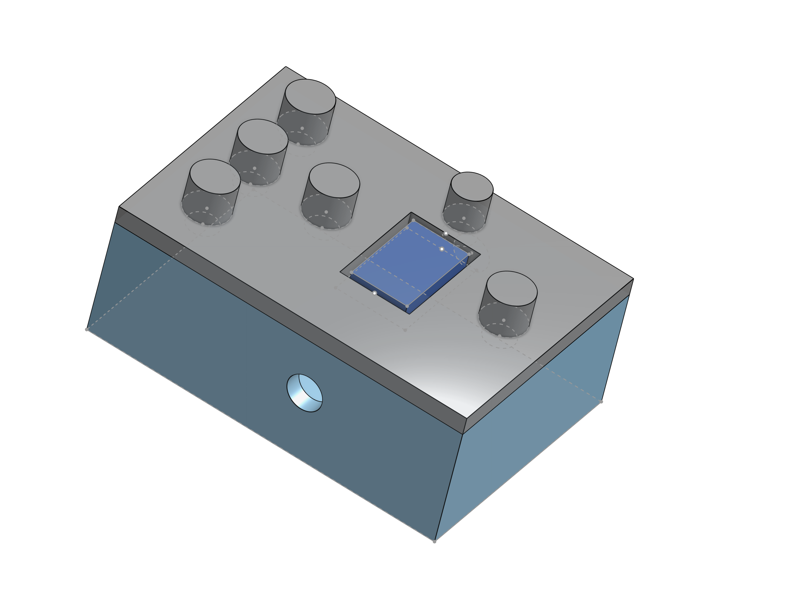
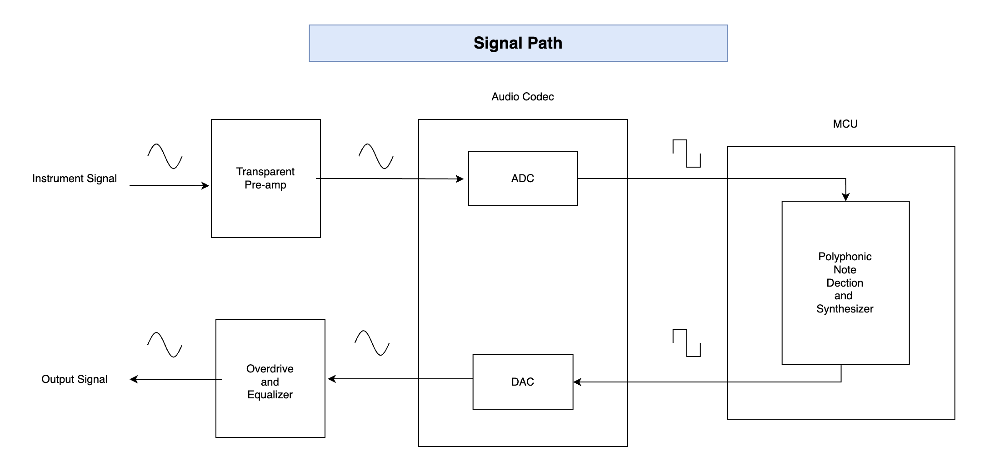
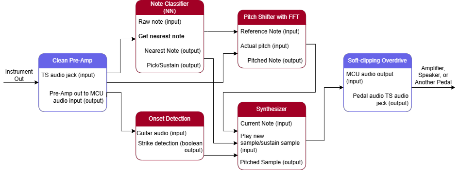
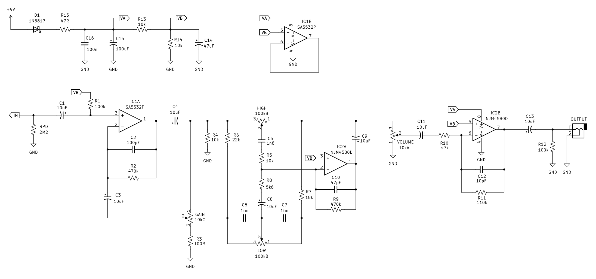

# GuSynth – Ultra-Low-Latency Polyphonic Guitar Synth Pedal

GuSynth is a research + hardware project building a **real-time polyphonic guitar synth pedal** capable of transforming a guitar into other instruments with **ultra-low latency**.

The project combines:

- **Transient-guided neural note detection**
- **Polyphonic inference for guitar input**
- **Direct neural timbre transfer**
- **Embedded deployment on microcontroller hardware**
- **Analog tone shaping and post-processing**

The goal is a **standalone guitar pedal** that lets a guitarist play naturally while hearing the output as another instrument.

---

## Overview

Most pitch detection and guitar synthesis systems rely on longer analysis windows, which adds noticeable delay. GuSynth instead focuses on extracting useful information from the **earliest part of the note**, especially the pick attack, so the system can react quickly enough for live performance.

The project currently explores two connected ML stages:

1. **First neural network:** fast polyphonic note detection from very short windows
2. **Second neural network:** direct timbre transfer from guitar to another instrument

A harmonic LUT-based pipeline and analog processing stages support the overall system.

---

## Signal Path

This is the full signal path of the pedal, from instrument input through conversion, inference/synthesis, and output shaping.

---

## Overall Pedal / System Schematic

This diagram shows the higher-level pedal architecture and how the DSP / neural / synthesis stages connect together.

---

## 424 / Analog Circuit Reference

This section documents one of the analog reference directions used in the project for tone shaping / overdrive exploration.

---

## Core System Architecture

### 1. First Neural Network – Polyphonic Note Detection

The first model is designed to recognize notes from **very short guitar input windows**, with a strong focus on the **transient / pick attack** region.

It is intended to:

- detect note activity quickly
- work under polyphonic conditions
- provide a MIDI-style or note-based representation
- operate under strict latency constraints suitable for embedded systems

#### Audio Demo – First NN

### Audio Demo – Timbre Transfer

<audio controls>
  <source src="./TIMBRE NET - In Developent/data/guitar/plaz.wav" type="audio/wav">
  Your browser does not support the audio element.
</audio>

**After (first NN output / note-detection-driven result):**

<audio controls>
  <source src="./TIMBRE NET - In Developent/data/piano/plaz.wav" type="audio/wav">
  Your browser does not support the audio element.
</audio>

> If GitHub does not render the audio player in your view, you can still click the files directly:
>
> - [Listen to guitar input](./TIMBRE%20NET%20-%20In%20Developent/data/guitar/plaz.wav)
> - [Listen to transformed output](./TIMBRE%20NET%20-%20In%20Developent/data/piano/plaz.wav)
---
### 2. Second Neural Network – Timbre Transfer

The second model takes guitar input and transforms it toward the sound of another instrument.

Current work is focused on **guitar → piano-style transfer**, with the long-term goal of supporting more instruments and cleaner real-time conversion.

It is intended to:

- preserve performance timing and expression
- reshape the raw guitar waveform into a target timbre
- run in a streaming low-latency pipeline
- support eventual embedded deployment

#### Video Demo – Second NN

<video controls width="800">
  <source src="Documentation/video/second_nn_demo.mp4" type="video/mp4">
  Your browser does not support the video tag.
</video>

> Direct link: [Second NN Demo Video](Documentation/video/second_nn_demo.mp4)

---

## Harmonic LUT Support Pipeline

Alongside the neural models, the project includes a harmonic fingerprint LUT approach used for analysis and refinement.

This system helps by:

- storing harmonic note templates
- comparing incoming spectra to expected note structure
- refining note hypotheses
- supporting interpretable DSP-guided analysis

Rather than treating the project as purely neural or purely classical DSP, GuSynth explores a **hybrid approach**.

---

## Embedded Hardware Target

The long-term target is a compact embedded pedal platform.

### Current embedded direction

- **Daisy Seed / Cortex-M7 class hardware**
- **48 kHz real-time audio**
- small-window streaming inference
- ADC / DAC audio pipeline
- analog front-end and output shaping

### Embedded constraints

- low total latency
- predictable real-time processing
- limited memory / compute budget
- models must be compact enough for sustained streaming

---

## Analog Processing

The pedal is not only digital / ML based. Analog stages are also important for:

- input conditioning
- gain staging
- distortion / overdrive
- EQ shaping
- reducing unpleasant artifacts in synthesized output

This is especially useful when blending guitar and synthetic instrument textures.

---

## Project Status

- ✅ First neural network prototype for transient-guided note detection
- ✅ Second neural network prototype for timbre transfer
- ✅ Harmonic LUT research pipeline
- ✅ System-level pedal architecture defined
- ⚠️ Embedded optimization still in progress
- ⚠️ More training data and refinement needed for cleaner output quality

---

## Repository Layout

- `Documentation/images/`  
  Diagrams, schematics, and system figures

- `Documentation/audio/`  
  WAV demos for model outputs

- `Documentation/video/`  
  Video demonstrations of the system

- `LUT - In Development/`  
  Harmonic fingerprint / template detection work

- `DAISY - In Development/`  
  Embedded hardware and firmware work

- `JUCE - In Development/`  
  Desktop or plugin prototyping

---

## Long-Term Goal

A standalone guitar pedal that:

- detects polyphonic playing with minimal delay
- converts guitar into the sound of other instruments
- runs on embedded hardware
- combines neural models, DSP, and analog circuitry
- remains responsive enough for real live performance

---

## Summary

GuSynth is a hybrid guitar-synthesis system exploring how far real-time note inference and timbre transfer can be pushed under embedded, performance-critical latency constraints.

It is not just a guitar effect — it is an attempt to turn the guitar into a **real-time expressive controller for other instruments**.