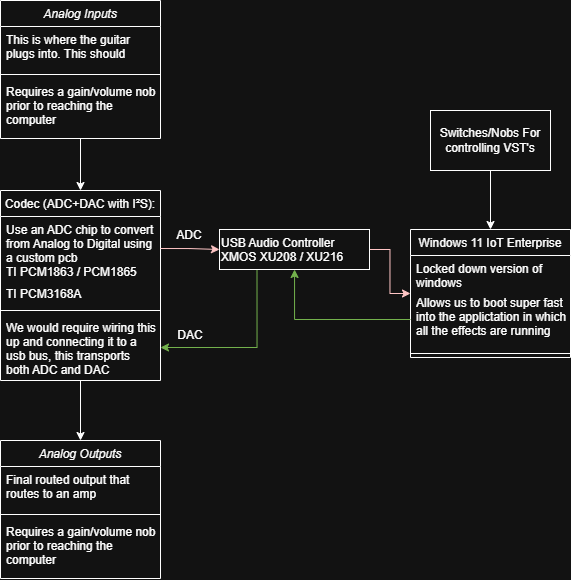
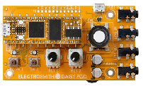

**Weekly Progress Summary**
As a group we have been making key design decisions for our project. This week we discussed if we should design a multi-effects guitar pedal vs a single-effect pedal and the pros and cons of each choice. This brought forth other obstacles as we went through the design checklist. We have been constantly reworking our need and goal statements as we question the practicality of our design choices. 

Each completed individual research and brought forth information to the group meetings about hardware, software, parts-ordering, timelines, etc. 

This period consisted of 3 scheduled meetings:

Meeting 1:

* Discussed potential project ideas and proposed many routes of each.  
  * Guitar Pedal/Effects Unit  
  * Book Digitizer  
  * Video Game Console  
  * Bike Helmet Crash Detection  
  * Etc.  
* We ended up narrowing our options down and voting on a project during this meeting.

Meeting 2:

* Met with our TA, and discussed how guitar effects units work  
* Realized there were two solid paths to take and we split into two groups to do research on each of these options and reconvene at the next meeting to discuss the scopes of each

Meeting 3:

* Presented our research  
* Presented viable prototype options  
* Discussed Custom Effects vs an Effects Unit  
* Pushed the decision of which route we will take for our next meeting

We had also established primary means of communication (discord), collaborative tools bringing together contributions. We will be using Google Drive to save important documents, keep a list of important links/materials, and to keep track of status reports and meetings moving forward. We hope to use Github to collaborate directly with the project and any meaningful developmental updates such as code and hardware.

**Next Week’s Goals:**  
We plan to reconvene on Monday 2/1/26 to decide on a multi effects unit or single effect pedal, decide on an embedded or Linux/Windows IoT based pedal, and begin ordering parts for our initial prototype.

*“Articulate the need as an expression of dissatisfaction with the current situation”*

**Current Need Statement**  
Guitar multi effects units don’t allow users to upload effects made with software other than the one the multi effects unit company supplied

OR 

There exists no guitar pedal that either digitally replicates a specific cool vintage pedal/amp/speaker or does this certain effect

*“A brief, general, and ideal response to the need statement”*

***Current Goal Statement***  
Design a multi effects unit that lets users upload their own custom VST effects regardless of the software platform used to create them and is easy to use

OR

Design an enviable guitar pedal that digitally (or analog \+ digital) recreates a vintage effect or rare/new/uncommon effect with low enough latency that the effect can be used for live performance and fits within a standard guitar pedal enclosure  
(define in seconds what low latency for a pedal is)

**Current Research Explored**

*Embedded vs. Linux based pedals*  
We divided the team up to explore our options for which platform would be most doable in the short amount of time we have for our capstone. There was a rising consensus to move forward with an embedded system but we are still exploring our options.

**Current embedded options explored**

Daisy seed: [https://electro-smith.com/products/daisy-seed?variant=45234245140772](https://electro-smith.com/products/daisy-seed?variant=45234245140772)   
Pros: Cheap, fast for prototyping, designed for audio projects  
Cons: Locked in at a lower speed.   
Teensy 4.0: [https://www.pjrc.com/store/teensy40.html](https://www.pjrc.com/store/teensy40.html)   
Pros: Higher processing power, may already have part  
Cons: Audio Implementation isn’t intuitive, may require audio shield

RPi 20240: [https://www.raspberrypi.com/products/rp2040/](https://www.raspberrypi.com/products/rp2040/)  
Pros: Cheap  
Cons: Low speed operations (higher latency)

**Current Linux options explored**

Pi-Stomp: [https://www.treefallsound.com/wiki/doku.php?id=start](https://www.treefallsound.com/wiki/doku.php?id=start)   
Pros: proof that hobbyist multi effect pedals that are Linux based exist, RPi5 is powerful and can achieve the low latency we’re looking for  
Cons: this completed project showed how difficult it may be to complete in our short amount of time, the project we had in mind is this team’s 3rd iteration, expensive

Pedal Pi: [https://www.electrosmash.com/pedal-pi](https://www.electrosmash.com/pedal-pi)   
Pros: RPi zeros are pretty cheap, a completed project to improve upon  
Cons: only one effect, unable to find the schematic and pcb files, dead project

**Current Windows options explored**  

Pros: User friendly, easily use VSTs, very powerful.  
Cons: Not much embedded programming going on, custom effects wouldn’t be a part of this project's scope.

**Guitar pedal standards, parts sourcing and manufacturing**

[Love My Switches](https://lovemyswitches.com/%20) is a hobbyist DIY and pedal repair site that offers a lot of parts for building and repairing pedals and has quick shipping. We can use them to source metal enclosures, switches, knobs, potentiometers, power switches and jacks, LEDs, audio jacks, and drill jigs.

[Mouser](https://www.mouser.com/) is an online supplier of electrical components

[Digikey](https://www.digikey.com/) is an online supplier of electrical components

[McMasterCarr](https://www.mcmaster.com/) is an online supplier of PPE, tools, raw materials, office supplies and anything else you need to make a factory this week

[PCBWay](https://www.pcbway.com/) can make and assemble PCBs and fabricate any 3D models we send over with CNC machining or 3D printing. PCBWay can possibly be a sponsor since they have previously sponsored one of our group members. WARNING NO MANUFACTURING DURING LUNAR NEW YEAR: FEB 15th \- FEB 18th

[JLCPCB](https://jlcpcb.com/) can make and assemble PCBs. WARNING NO MANUFACTURING DURING LUNAR NEW YEAR: FEB 16th \- FEB 19th

[Slugworks](https://slugworks.engineering.ucsc.edu/) makerspace is on campus and has a lot of tools that undergraduates have access to after going through the trainings.

[Pawprint Prototyping](https://pawprintprototyping.org/) is a makerspace open to the public in Santa Clara with different tools than Slugworks offers. One of our group members holds a membership with the ability to supervise members of the public using the makerspace’s tools.

**Guitar Effects Creation**

If we go the embedded route, we need a way to make audio effects. There are numerous tools to assist in creating these effects. The Daisy ecosystem already has an open-source library (C++)  for DSP: [https://github.com/electro-smith/DaisySP](https://github.com/electro-smith/DaisySP). Another approach for DSP would be to use a tool that compiles into C++ to use on an embedded device such as MATLAB and [FAUST](https://faustdoc.grame.fr/). FAUST is a functional language with an online IDE, which can be used to create effects and listen to audio output right on your computer. This may allow us to speed up effects development, but more research is needed. 

**Hardware Motherboard**

We were looking into the [Daisy Pod](https://electro-smith.com/products/pod) which has lots of the connecting hardware we require for the project, however it only has two knobs and buttons which is vastly different from our objective goals. Technically, we could string together many of these pods, but that is an expensive, unoptimized solution. Therefore, we may buy a Daisy Pod for testing software purposes, but for our final goal, we will be making a custom PCB that supports many different types of inputs and allows for multiple pedal support for our final deliverable.   

